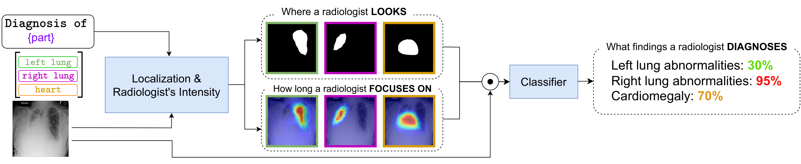

# [WACV 2024] I-AI: A Controllable & Interpretable AI System for Decoding Radiologists’ Intense Focus for Accurate CXR Diagnoses

### Trong Thang Pham, Jacob Brecheisen, Anh Nguyen, Hien Nguyen, Ngan Le

#### [[paper]](https://arxiv.org/abs/2309.13550)

## Introduction

In the field of chest X-ray (CXR) diagnosis, existing works often focus solely on determining where a radiologist looks, typically through tasks such as detection, segmentation, or classification. However, these approaches are often designed as black-box models, lacking interpretability. In this paper, we introduce Interpretable Artificial Intelligence (I-AI) a novel and unified controllable interpretable pipeline for decoding the intense focus of radiologists in CXR diagnosis. Our I-AI addresses three key questions: where a radiologist looks, how long they focus on specific areas, and what findings they diagnose. By capturing the intensity of the radiologist's gaze, we provide a unified solution that offers insights into the cognitive process underlying radiological interpretation. Unlike current methods that rely on black-box machine learning models, which can be prone to extracting erroneous information from the entire input image during the diagnosis process, we tackle this issue by effectively masking out irrelevant information. Our proposed I-AI leverages a vision-language model, allowing for precise control over the interpretation process while ensuring the exclusion of irrelevant features.
To train our I-AI model, we utilize an eye gaze dataset to extract anatomical gaze information and generate ground truth heatmaps. Through extensive experimentation, we demonstrate the efficacy of our method. We showcase that the attention heatmaps, designed to mimic radiologists' focus, encode sufficient and relevant information, enabling accurate classification tasks using only a portion of CXR. 


### Installation
1. Clone the repository
    ```sh
    git clone https://github.com/UARK-AICV/IAI.git
    ```
2. Navigate to the project directory
    ```sh
    cd IAI
    ```
3. Install the dependencies
    ```sh
    bash installenv.sh
    ```


### Usage


- #### Pretrained Weights

  |Model|Config |Weights|
  |-----|-------|---|
  |iai|configs/tsan_biomedclip_l2_mask_dice_heatmap_e2e_v2.yaml |coming soon |

### Demo
To generate the results from a folder, please run 
```bash
python demo/demo_producing_all_mask.py --input <input_folder> --output <output_folder> --config <config_file> --weights <weights_file>
```

